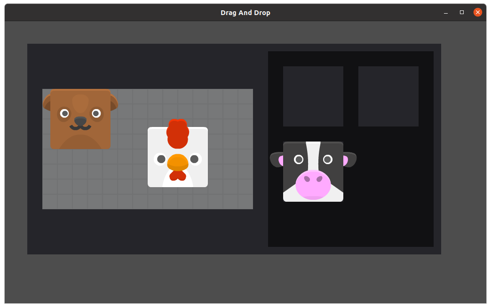

# Drag and Drop example
* based on: https://www.youtube.com/watch?v=usWuBrrh5lQ
* assets based on: https://www.kenney.nl/assets/animal-pack-redux

## About
* main scene is `Inventory.tscn`
    * Project > Project Settings > Run > Main Scene ...
* _ItemRepository_: this contains the available items (in my case the animals)
* _Inventory_: is the main scene. here the grapping is implemented
    * we want to drag the items from _GridPackPack_ to _EquipmentSlots_
* for each of these nodes a script implements the behaviour:
``` 
ItemRepository.gd
Inventory.gd
GridPackPack.gd
EquipmentSlots.gd
``` 

## Autoload / Singleton
* with Autoload we can define a scene as a Singleton and access it from script.
    * Project > Project Settings > Autload > Add the scene
    * example access: `ItemRepository.get_item (...`


